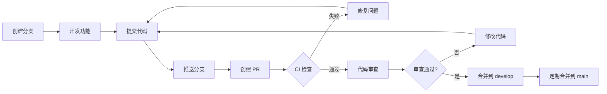

# 分支保护规则配置指南

## 概述

本文档说明如何为 llm-test 项目配置 GitHub 分支保护规则，确保代码质量和团队协作效率。

---

## 主分支 (main) 保护规则

### 基本设置

在 GitHub 仓库设置中配置以下规则：

**Settings → Branches → Add rule**

**分支名称模式:** `main`

### 必需选项

| 选项 | 状态 | 说明 |
|------|------|------|
| ✅ Require a pull request before merging | **启用** | 禁止直接推送 |
| ✅ Require approvals | **启用** | 需要至少 1 个审查 |
| ✅ Dismiss stale reviews when new commits are pushed | **启用** | 新提交需重新审查 |
| ✅ Require review from CODEOWNERS | **启用** | 按文件指定审查者 |
| ✅ Require status checks to pass before merging | **启用** | CI 必须通过 |
| ✅ Require branches to be up to date before merging | **启用** | 必须是最新的 |
| ❌ Do not allow bypassing the above settings | **禁用** | 管理员可绕过 |

### 必需的状态检查

选择以下检查项为**必需**：

```
✓ lint
✓ security-tests
✓ unit-tests (Python 3.10)
✓ unit-tests (Python 3.11)
✓ unit-tests (Python 3.12)
✓ import-check
✓ dependency-check
```

### 其他选项

| 选项 | 状态 | 说明 |
|------|------|------|
| Require conversation resolution before merging | 可选 | 所有讨论必须解决 |
| Require linear history | 可选 | 强制线性提交历史 |
| Require branches to be up to date | **推荐启用** | 合并前必须更新 |

---

## 开发分支 (develop) 保护规则

**分支名称模式:** `develop`

### 必需选项

| 选项 | 状态 | 说明 |
|------|------|------|
| ✅ Require a pull request before merging | **启用** | 禁止直接推送 |
| ✅ Require approvals | **启用** | 需要至少 1 个审查 |
| ✅ Require status checks to pass | **启用** | CI 必须通过 |

### 必需的状态检查

```
✓ lint
✓ security-tests
✓ unit-tests
```

---

## 功能分支规则

**分支命名规范:**

```bash
# 功能分支
feature/功能名称

# 修复分支
fix/问题描述

# 热修复分支
hotfix/紧急问题描述

# 文档分支
docs/文档更新
```

---

## CODEOWNERS 配置

创建 `.github/CODEOWNERS` 文件：

```github
# 全局所有者 - 适用于所有文件
* @maintainer-team

# 核心模块 - 需要核心开发者审查
core/ @core-dev-team
core/providers/ @provider-team
core/benchmark_runner.py @bench-team

# 评估器
evaluators/ @evaluator-team

# UI 组件
ui/ @ui-team

# 安全相关文件
core/safe_executor.py @security-team
core/url_validator.py @security-team
tests/test_security.py @security-team

# 文档
*.md @doc-team
docs/ @doc-team

# 工作流
.github/workflows/ @devops-team

# 配置文件
pyproject.toml @core-dev-team
requirements*.txt @core-dev-team
```

---

## PR 模板

创建 `.github/PULL_REQUEST_TEMPLATE.md`：

```markdown
## 变更摘要
<!-- 简要描述此 PR 的目的 -->

## 变更类型
- [ ] Bug 修复
- [ ] 新功能
- [ ] 破坏性变更
- [ ] 文档更新
- [ ] 性能优化
- [ ] 代码重构

## 测试
- [ ] 添加了新测试
- [ ] 现有测试通过
- [ ] 手动测试完成

## 检查清单
- [ ] 代码符合项目规范
- [ ] 自我审查代码
- [ ] 添加了必要的注释
- [ ] 更新了相关文档

## 相关 Issue
Closes #(issue number)

## 截图/演示
<!-- 如果适用，添加截图或演示 -->

## 额外说明
<!-- 任何其他审查者需要了解的信息 -->
```

---

## Issue 模板

创建 `.github/ISSUE_TEMPLATE/bug_report.md`：

```markdown
---
name: Bug 报告
about: 报告问题帮助我们改进
title: '[BUG] '
labels: bug
assignees: ''
---

## 问题描述
<!-- 清晰简练地描述问题 -->

## 复现步骤
1.
2.
3.

## 期望行为
<!-- 描述你期望发生什么 -->

## 实际行为
<!-- 描述实际发生了什么 -->

## 环境信息
- OS:
- Python 版本:
- llm-test 版本:

## 额外信息
<!-- 任何其他信息、截图、日志 -->
```

---

## 工作流程

### 开发流程



### 发布流程

1. **从 main 创建 release 分支**
   ```bash
   git checkout main
   git pull
   git checkout -b release/v2.1.0
   ```

2. **更新版本号**
   - 更新 `pyproject.toml` 中的版本号
   - 更新 CHANGELOG.md

3. **创建 PR 合并到 main**

4. **打标签并发布**
   ```bash
   git tag -a v2.1.0 -m "Release v2.1.0"
   git push origin v2.1.0
   ```

---

## 自动化规则

### PR 自动标签

使用 `.github/workflows/pr-labeler.yml`:

```yaml
name: Pull Request Labeler
on:
  pull_request:
    types: [opened]

jobs:
  labeler:
    runs-on: ubuntu-latest
    steps:
      - uses: actions/labeler@v5
        with:
          repo-token: ${{ secrets.GITHUB_TOKEN }}
          configuration-path: .github/labeler.yml
```

### 标签配置 (`.github/labeler.yml`)

```yaml
# 根据修改的文件自动添加标签
"bug":
  - changed-files:
      - any-glob-to-any-file: ["core/**/*.py"]

"documentation":
  - changed-files:
      - any-glob-to-any-file: ["**/*.md", "docs/**"]

"security":
  - changed-files:
      - any-glob-to-any-file:
          - "core/safe_executor.py"
          - "core/url_validator.py"
          - "tests/test_security.py"

"ui":
  - changed-files:
      - any-glob-to-any-file: ["ui/**/*.py"]

"tests":
  - changed-files:
      - any-glob-to-any-file: ["tests/**/*.py"]
```

---

## 检查清单

### 提交前检查

- [ ] 代码通过 `ruff check`
- [ ] 代码通过 `black --check`
- [ ] 代码通过 `mypy` (可选)
- [ ] 所有测试通过 `pytest`
- [ ] 安全测试通过 `pytest tests/test_security.py`
- [ ] 更新了相关文档
- [ ] 添加了必要的测试

### PR 创建检查

- [ ] PR 标题清晰描述变更
- [ ] PR 描述包含了变更摘要
- [ ] 关联了相关的 Issue
- [ ] 添加了适当的标签
- [ ] 指定了审查者

---

## 故障排查

### CI 失败常见原因

1. **Lint 失败**
   ```bash
   # 本地运行检查
   ruff check .
   black --check .
   ```

2. **测试失败**
   ```bash
   # 本地运行测试
   pytest tests/ -v
   ```

3. **安全测试失败**
   ```bash
   # 本地运行安全测试
   pytest tests/test_security.py -v
   ```

### 状态检查超时

如果 CI 运行时间过长：

1. 检查是否有死循环
2. 检查是否有网络请求超时
3. 检查测试数据是否过大

---

## 最佳实践

1. **保持分支小而聚焦** - 一个 PR 只做一件事
2. **频繁更新分支** - 定期从上游合并
3. **及时响应审查** - 24 小时内回复评论
4. **编写清晰的提交信息** - 使用规范的提交信息格式
5. **保持 CI 通过** - 不要推送失败的提交
6. **删除已合并的分支** - 保持分支列表整洁

---

## 提交信息规范

使用 Conventional Commits 格式：

```
<type>[optional scope]: <description>

[optional body]

[optional footer(s)]
```

**类型 (type):**
- `feat`: 新功能
- `fix`: Bug 修复
- `docs`: 文档更新
- `style`: 代码格式（不影响功能）
- `refactor`: 重构
- `perf`: 性能优化
- `test`: 测试相关
- `chore`: 构建/工具链相关
- `ci`: CI 配置
- `security`: 安全相关

**示例:**
```
feat(benchmark): add concurrent test support

- Implement concurrent test runner
- Add thread-safe metrics collection
- Update documentation

Closes #123
```
